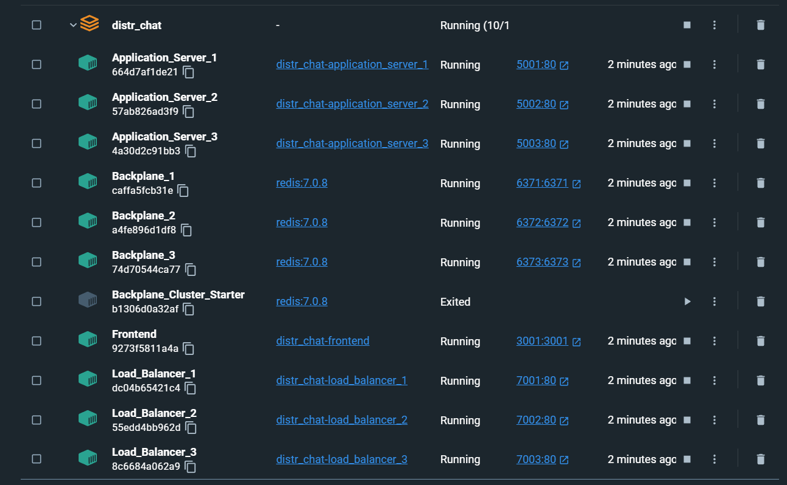
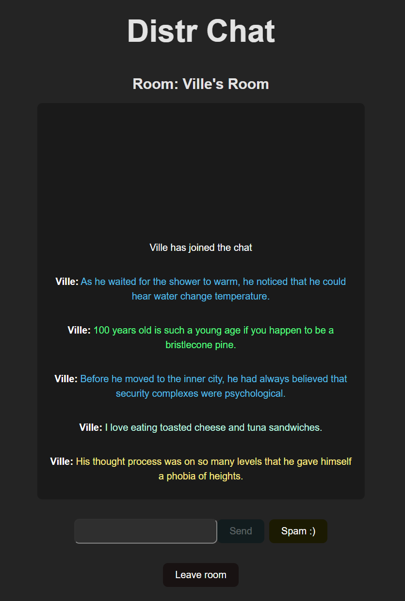
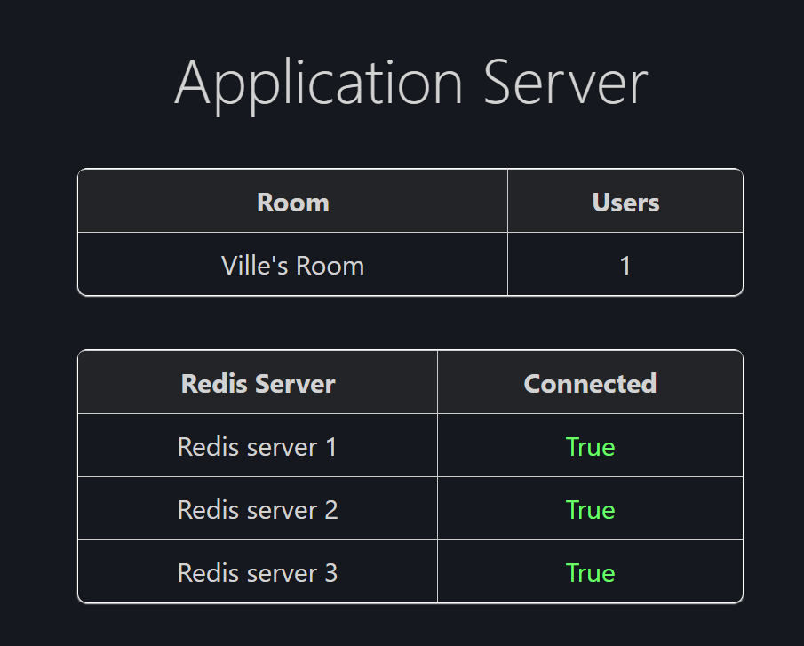
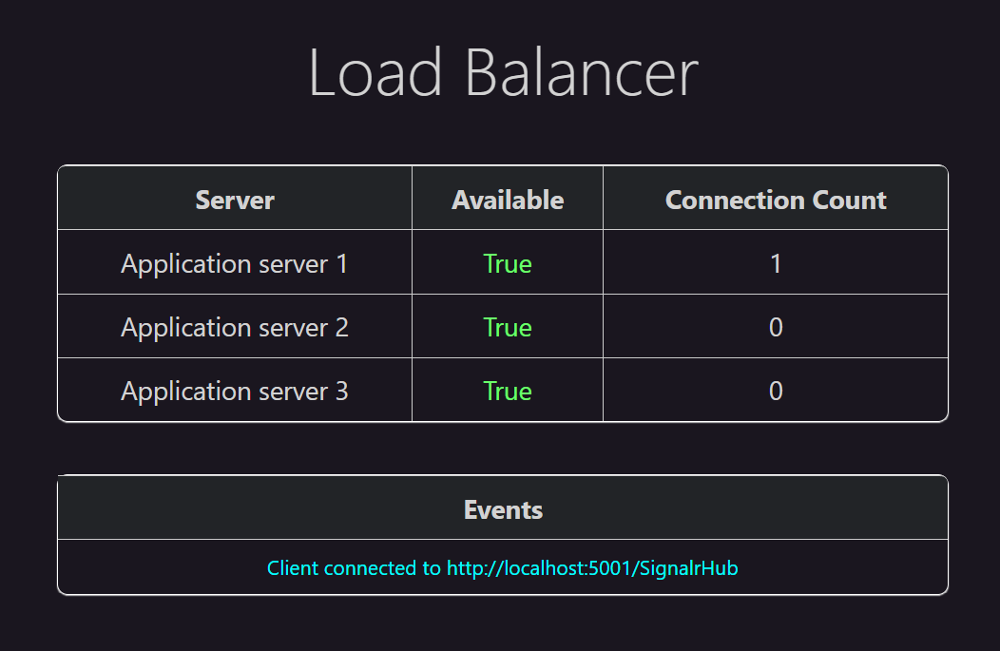
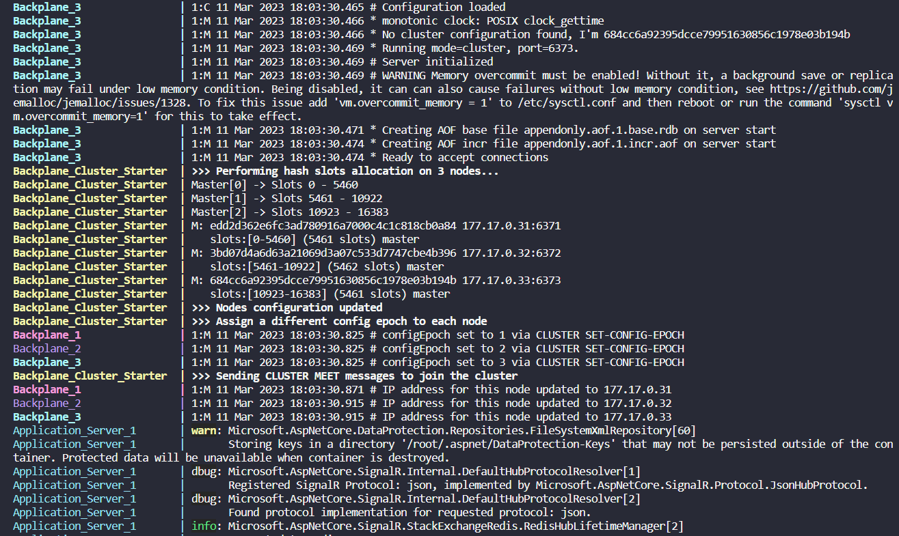
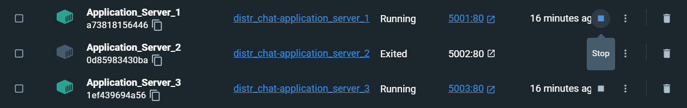
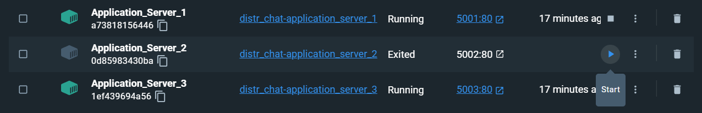
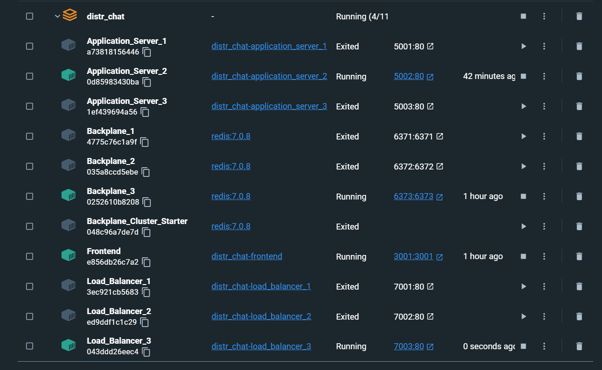
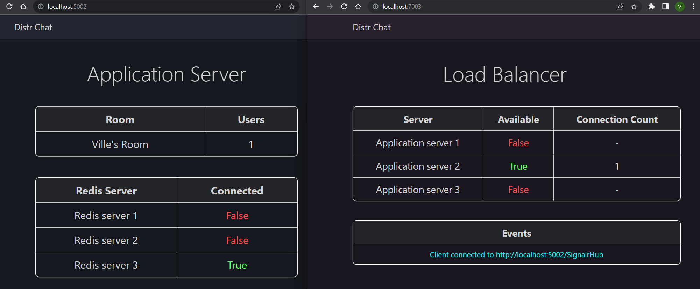

# Distr Chat

Horizontally scalable and high availability real-time messaging system.

---

## Running the Project

The whole project can be run with a single `docker compose up` command.

Tested only with _Docker Engine v20.10.22_ and _Windows 11_.

1. Install and run [Docker](https://www.docker.com/) if not already installed.

2. Open command prompt in the **root folder** (Distributed-Systems-Project)

3. Create a Docker network:

`docker network create --subnet=177.17.0.0/16 distr_network`

4. Run:

`docker compose up`

The images pulled will be _.NET 6.0_, _Redis 7.0.8_, and _Node:18.14.0_.

If the frontend has problems running in Docker, you may enter the `./Frontend` folder, first run `npm install`, and then run `npm run dev`. This should be a fixed issue.

5. Open Docker Desktop (this guide is for Docker Desktop, you may use the CLI if you like and know how), and open/expand the distr_chat container.

If everything launched correctly, the view should be like this (sorted by name):

The containers running should be: 3 application servers, 3 backplanes, 3 load balancers, and a single frontend.

The container named Backplane_Cluster_Starter has exited on purpose. This container is used only to execute a command to activate Redis Cluster mode in the 3 backplane nodes, and it exits on success.

---

## Observable Functionality

To open the different user interfaces, you can simply click the Port links on Docker Desktop. You can find the nodes running in these ports:

- Frontend: `http://localhost:3001/`

- Application_Server_1: `http://localhost:5001/`

- Application_Server_2: `http://localhost:5002/`

- Application_Server_3: `http://localhost:5003/`

- Load_Balancer_1: `http://localhost:7001/`

- Load_Balancer_2: `http://localhost:7002/`

- Load_Balancer_3: `http://localhost:7003/`

The backplane containers have no UI.

### User Interfaces

Type a username and a room name to enter a chat room. It's a typical chat interface. I got tired of typing messages when testing, so there is a helpful `Spam :)` button to quickly send messages.

The application server UI keeps track of the rooms and their user counts, and the Redis backplane connections:

The load balancer UI keeps track of the availability of the application servers and their WebSocket connetion counts. The events when a frontend client is connected to an application server are also logged.

If you like seeing words go fast you may also check the Docker logging in the command prompt with which you ran `docker compose up`. In the log, you may spot this backplane warning: `WARNING Memory overcommit must be enabled!...`. This warning could be fixed by enabling overcommit on your *host* machine (i.e., not inside Docker - impossible because of privileges), but it does not affect testing this system and *you should just ignore it*.

### Observing the Load Balancer Algorithm Working

The load balancers always connect the client to the application server with the lowest number of current connections. You may observer this happen by opening multiple frontend browser tabs and joining chat rooms. For example, open 3 tabs and join chat (same or different rooms - doesn't matter). Then, leave and rejoin with a client either connected to app server 1 or 2. You will observe that the clients are always connected to the app servers with 0 connections. Only with 4 tabs you will be able to get 2 connections in the same app server.

### Observing the Backplane Working

Notice that as long as the users have joined the same room, they will receive each other's messages even though they are connected to different application servers.

## Observing the Fail-Overs and States of Failure

Stop and relaunch different nodes in Docker Desktop by clicking the stop or start buttons:

If there is at least one node of each type running (1 application server, 1 load balancer, 1 backplane), you should observe the frontend chat still available and working.

When killing backplane nodes, there might be a few seconds during which you can't send messages. When you kill application nodes, the clients connected to the killed node will get thrown out of the chat rooms.

This is still a working state:

If you kill load balancer nodes 1 and 2, you will notice the client takes longer to connect as it always tries to contact load balancer nodes 1 and 2 first.

If you kill either all the application server nodes or the backplane nodes, the load balancer will give an error to the client and log: "_Client attempted to connect while all app servers were unavailable_".

If you kill all the load balancer nodes, the frontend client will not be able to connect to an application server. The frontend client will attempt to contact each load balancer 3 times, before giving up after they all timeout.

You may observe the application server and load balancer UI's update as you stop and restart nodes.

---

# Additional Documentation

This distributed systems project is a chat application which is designed as a distributed system in order to enable high availability and horizontal scaling. The frontend is kept as a simple chat in order to focus on the backend system design and architecture. This same setup could of course be used for other types of applications which utilize real-time updates for a high amount of concurrent users.

The chat will connect to an application server with a WebSocket connection in order to achieve real-time updates. However, the number of WebSocket connections is quite limited for a single server. It often becomes the limiting factor before the message throughput rate does. Therefore, the system should be designed in such a way that the number of application servers can be increased to match the load. In other words, the application servers should be horizontally scalable.

Another reason for running the same service on multiple servers is achieving high availability. That is, the system should be as fault tolerant as possible in order to minimize potential downtime of the service. To achieve this, it should be possible to run replicas of each part of the system so that there is no single-point-of-failure in the system. The system should continue running if any of the different types of nodes in the system fail.

High availability and fault tolerance are the main focus points of the project. To prove horizontal scalability having access to multiple real servers is required. Thus, while horizontal scalability is a motivational factor in this project, its proof is left as an implication of being capable of spreading the WebSocket connections over multiple nodes.

## Architecture and Design

In the system, a client may connect to any one of the application servers through a load balancer, and the client should still receive messages sent by a client which is connected to any different application server. This is not possible without another type of node or some other solution to relay messages between the application servers because the application server can only send messages to clients which are connected to it. In this project, I will utilize a backplane server as a message broker between the application servers. Thus, there will be 4 different types of nodes, as I have depicted in the system architecture diagram below.

### Frontend Client

Frontend is the chat application visible to the user. There will be as many client nodes as there will be users. First, the user will input an username and a chat room name. In the chat room, the user can send text messages and will see messages sent by other users in the same room. Due to familiarity, I will implement the frontend with TypeScript using React framework.

### Load Balancer

The purpose of the load balancer is to spread the clients' connections evenly between the application servers. The load balancer communicates with the application servers to receive data of the application server's current load. It will make the decision about which application server to connect the user to based on the load. Load in the algorithm being the number of WebSocket connections to the server. The load balancer will connect the client to the application server with the lowest load (or any server tied for the lowest load).

Due to familiarity with the language, I will implement the load balancer with C\# as a .NET Core application.

### Application Server

The application server handles the main server side business logic of the application. It will hold the WebSocket connections from the clients, through which it will receive messages from the clients and publish those messages to the correct chat rooms. The application server will also track the number of users in each chat room, and importantly for the load balancer, the total count of connections.

I will also implement the application server with C\# as a .NET Core application. Handling of the WebSocket connections and sending messages will be done with SignalR which is basically .NET's standard WebSocket implementation.

I consider that there is no need for persistence for the messages. The system is interested purely in real-time communication. If there was a need, a database or a data stream (Apache Kafka, Redis Stream, etc.) depending on the persistence requirements could be incorporated.

### Backplane

The purpose of the backplane is to relay messages between the application servers. It is essentially a message broker. There is support for a backplane implementation in SignalR, options including for example Redis, Azure, and SQL Server backplane-options. I chose Redis as the backplane because it is open source and, as opposed to cloud options, you can set up your own Redis servers.

I researched the ways to achieve high availability in Redis. In Microsoft's .NET documentation entitled "_Set up a Redis backplane for ASP.NET Core SignalR scale-out_", everything that was originally written about Redis Cluster was that "_Redis Clustering is a method for achieving high availability by using multiple Redis servers. Clustering isn't officially supported, but it might work._". The last sentence was changed to "_Clustering is supported without any code modifications to the app_" in January 2023 ([source](https://github.com/dotnet/AspNetCore.Docs/commit/409a89091770fda764e332f1ab6bc41ad2e66821)).

However, researching further I found out that the message throughput (messages per second) of Redis Pub/Sub decreases as the number of nodes in the cluster is increased ([source: video](https://www.youtube.com/watch?v=6G22a5Iooqk)) ([source: presentation slides](https://www.slideshare.net/RedisLabs/redis-day-tlv-2018-scaling-redis-pubsub)). SignalR uses Redis Pub/Sub in any Redis backplane option under the hood. Thus, a high availability setup where there is only a single active backplane node would be more optimal. I opened up an issue in the _aspnetcore_ GitHub asking for an update to the documentation ([source](https://github.com/dotnet/aspnetcore/issues/46408)). I also gave a feature suggestion that the sharded Pub/Sub released in the Redis version 7.0 in April 2022 could be utilized to possibly achieve horizontal backplane message throughput scaling for SignalR. Following the issue, I also opened a pull request to update the Redis Cluster section in the SignalR Redis documentation to inform about the message throughput trade-off and to guide in the configuration for the Cluster ([source](https://github.com/dotnet/AspNetCore.Docs/pull/28310)). This pull request was merged on February 10, 2023, making me one of the contributors in the [documentation article](https://learn.microsoft.com/en-us/aspnet/core/signalr/redis-backplane?view=aspnetcore-6.0), specifically the "_Redis Cluster_" section.

What then if the number of messages delivered by the backplane decreases with the number of nodes in the Redis Cluster, can it still be used as the backplane? In benchmarks by Redis the messages throughput was still 100 000 messages per second for a Cluster of 3 active nodes ([source: video](https://www.youtube.com/watch?v=6G22a5Iooqk)) ([source: presentation slides](https://www.slideshare.net/RedisLabs/redis-day-tlv-2018-scaling-redis-pubsub)). I will research further if Redis Sentinel or simple replication is compatible as a backplane for SignalR. If compatibility with SignalR would require forking the repository of SignalR, Redis, or the underlying dependencies, I will consider this outside the scope of this project, as the Redis Cluster will still satisfy the main goal of the project - high availability - and a message throughput of 100 000 per second is high enough for many systems. In the discussion of the GitHub issue it was mentioned that the SignalR implementation uses a library called _StackExchange.Redis_ which should first support sharded Pub/Sub before SignalR tries to utilize it ([source](https://github.com/dotnet/aspnetcore/issues/46408#issuecomment-1414040067)).

## Naming

The application server handles any logic related to naming. WebSocket connections have unique identifiers so that the total count of connections and users in each chat room can be tracked. Messages appointed to a specific chat room will only be broadcasted to the room with that specific name. A unique prefix will be used for the communication through the backplane so that the messages of this system would never be confused with the messages of another module which might use the same backplane in the future.

## Coordination

The coordination in the system which I will implement is the load balancer communicating with the application servers to gain information about their current active connection count and connect new clients based on that information. The Redis Cluster or the other potential Redis options have their own in-built coordination.

%For example, the Redis Sentinel set up would have a configurable quorum based algorithm for choosing a new master in the case of a fail-over.

## Consistency and Replication

Each node will be replicable. However, due to no persistent data in the system, consistency is mainly not a concern. The only type of consistency visible to the client will be the order of the chat messages. That is, different clients could receive the same messages in different order. The application server which first receives the message will timestamp the messages and the correct order or the messages will be decided by these timestamps. If the messages are received on the exact same millisecond then I make the decision to not care which message gets shown first. I consider the price for the messages being in a wrong order in a rare case acceptable. Having lax consistency requirements lets us focus on availability and fault tolerance (CAP theorem).

## Security

I consider security not to be a focus of this project. For future work, the nodes should require API keys for communication, the messages could be encrypted in the backend, and the users could have authentication in the frontend.

## Evaluation - High Availability, Fault Tolerance

High availability and fault tolerance are the main evaluation criteria of the system. Testing and showcasing the system will be accomplished by stopping and restarting the Docker containers to mock server failures in all the different types of nodes (frontend, load balancer, application server, backplane). As long as not all the nodes of a single type are killed, you should be able to kill any node and the system will continue running seemingly without fault to the client, other than possibly a few seconds hiccup before connection to other node replaces the fallen node. The chat service would be unavailable only if all the nodes in one of the four categories are killed.

As mentioned in the introduction, horizontal scalability was one of the motivations for this project but due to need of real separate servers its proof is left as an implication of being able to replicate the application servers. In other words, multiple servers should be able to hold more WebSocket connections than a single server. Making the message throughput of the Redis backplane horizontally scalable I consider to be future work due to the dependency mentioned with _StackExchange.Redis_.

<!--
`docker network create --subnet=177.17.0.0/16 distr_network`

**3. Pull Redis Docker image:**

`docker pull redis`

**4. Run Redis Cluster container:**

`docker compose --file ./Backplane/Cluster/docker-compose.yml up`

**5. Build application server Docker image:**

`docker build -t distr_chat:1 "./Application Server"`

**6. Run two application server containers:**

`docker run -d --hostname distr_server_1 --net distr_network --ip 177.17.0.5 --add-host redis:177.17.0.255 -p 5000:80 --name distr_server_1 distr_chat:1`

`docker run -d --hostname distr_server_2 --net distr_network --ip 177.17.0.6 --add-host redis:177.17.0.255 -p 5001:80 --name distr_server_2 distr_chat:1`

**7. Build frontend (will pull [node image](https://hub.docker.com/_/node/)) Docker image:**

`docker build -t distr_frontend:1 ./Frontend`

**8. Run frontend Docker container:**

`docker run -d --hostname distr_frontend --net distr_network -p 3000:3000 --name distr_frontend distr_frontend:1`
 -->
